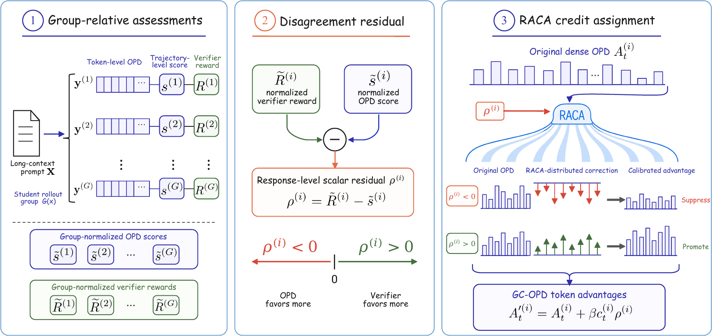

# GC-OPD: Group-Calibrated On-Policy Distillation

<strong>Zhu Zhang<sup>\*</sup>, Jixun Wang<sup>\*</sup>, Xiaoang Xu,
Xiaorong Wang, Zihan Zhou, Zhiyuan Wang, Shuo Wang,
Chaojun Xiao<sup>&dagger;</sup>, and Yuezhi Zhou<sup>&dagger;</sup></strong>

<sup>*</sup> Equal contribution. <sup>&dagger;</sup> Corresponding authors.

[](LICENSE)
[](requirements.txt)

## Overview

**GC-OPD** improves on-policy distillation for long-context reasoning by combining
dense token-level teacher guidance with response-level verifier feedback. It
separately normalizes verifier rewards and trajectory-level OPD scores within
each rollout group, forms their signed teacher-verifier disagreement residual,
and uses relative-advantage-based credit assignment (RACA) to distribute the
residual across response tokens while retaining the original dense OPD
advantage.

<p align="center">
  
</p>

This repository is built on `verl` and includes the GC-OPD training path,
Qwen3-4B and Qwen3-8B entrypoints for vanilla OPD and GC-OPD, a
five-benchmark evaluation protocol, focused regression tests, and a
frozen-rollout analysis pipeline.

## Updates

- **2026-08-18**: Initial public code release.

## Installation

The released training stack was verified on Linux x86_64 with Python 3.12,
CUDA 12.8, PyTorch 2.10.0, vLLM 0.17.0, Ray 2.54.0, Transformers 4.57.1,
and FlashAttention 2.8.3. Clone the repository and create the environment with:

```bash
git clone https://github.com/SolereZhang/GC-OPD.git
cd GC-OPD

python3.12 -m venv .venv
source .venv/bin/activate
python -m pip install --upgrade pip setuptools wheel
python -m pip install --index-url https://download.pytorch.org/whl/cu128 \
  torch==2.10.0 torchvision==0.25.0 torchaudio==2.10.0
python -m pip install --no-build-isolation -r requirements.txt
python -m pip install -e ./verl --no-deps
```

The PyTorch installation must match the local NVIDIA driver and CUDA runtime;
the commands above reproduce the tested CUDA 12.8 package set. Building
FlashAttention requires a CUDA toolkit and compiler toolchain. Model weights
and datasets are not redistributed in this repository and must be obtained
under their respective licenses. The evaluation harness uses the separately
recorded environment in [`evaluation/requirements-eval.txt`](evaluation/requirements-eval.txt).

## Quick Start

Training uses the public
[`Kwai-Klear/GoLongRL`](https://huggingface.co/datasets/Kwai-Klear/GoLongRL)
data prepared as a 32K-token train/validation split. By default, the launchers
look for data, models, and outputs next to the cloned repository:

```text
workspace/
|-- GC-OPD/
|-- data/golongrl_32k/
|   |-- train.parquet
|   `-- val.parquet
|-- models/
|   |-- Qwen3-4B/
|   |-- Qwen3-8B/
|   `-- Qwen3-30B-A3B-Thinking-2507/
`-- outputs/
```

With this layout, no path variables are required. To use another storage
location, override the three directory roots:

```bash
export DATA_DIR=/path/to/data
export MODEL_DIR=/path/to/models
export OUTPUT_DIR=/path/to/outputs
```

`TRAIN_DATA`, `VAL_DATA`, `TEACHER_MODEL`, `STUDENT_MODEL_4B`, and
`STUDENT_MODEL_8B` remain available when an individual path needs to differ
from the directory convention.

### Data and Model Preparation

Download the public GoLongRL dataset and Qwen3 checkpoints with the Hugging
Face CLI installed by `requirements.txt`:

```bash
hf download Kwai-Klear/GoLongRL \
  --repo-type dataset \
  --local-dir ../data/GoLongRL

hf download Qwen/Qwen3-4B \
  --local-dir ../models/Qwen3-4B
hf download Qwen/Qwen3-8B \
  --local-dir ../models/Qwen3-8B
hf download Qwen/Qwen3-30B-A3B-Thinking-2507 \
  --local-dir ../models/Qwen3-30B-A3B-Thinking-2507
```

Prepare the exact paper split:

```bash
python scripts/prepare_golongrl_32k.py --overwrite
```

The preparation script follows the training data path exactly. It appends the
GRPO output-format instruction, holds out the first 256 examples in the
ordered GoLongRL shards, applies the Qwen3 chat template with
`enable_thinking=False`, and keeps rendered prompts with at most 32,768 tokens.
It verifies the expected result of 9,527 training rows and 231 validation rows
and writes the length summary to `../data/golongrl_32k/stats.json`.

For a different storage layout, pass explicit paths:

```bash
python scripts/prepare_golongrl_32k.py \
  --input-dir /path/to/GoLongRL/data \
  --tokenizer-path /path/to/Qwen3-4B \
  --output-dir /path/to/golongrl_32k \
  --overwrite
```

Run one of the paper configurations:

```bash
# Qwen3-4B
bash scripts/run_opd_4b_training.sh
bash scripts/run_gc_opd_4b_training.sh

# Qwen3-8B
bash scripts/run_opd_8b_training.sh
bash scripts/run_gc_opd_8b_training.sh
```

Use `DRY_RUN=1` to print the resolved training command without loading a model:

```bash
DRY_RUN=1 bash scripts/run_gc_opd_8b_training.sh
```

The OPD entrypoints use the GC-OPD implementation with `beta=0`, which reduces
exactly to vanilla OPD. The GC-OPD entrypoints use RACA with `beta=0.10`.

## Training Setup

| Setting | Value |
|---|---:|
| Training prompts per step | 32 |
| Responses per prompt | 8 |
| Maximum prompt length | 32,768 |
| Maximum response length | 10,240 |
| Learning rate | `1e-6` |
| Training steps | 100 |
| Seed | 42 |
| Student generation | no-thinking |

The launchers accept no positional arguments or Hydra overrides. Only runtime
locations and operational controls are configurable:

- `DATA_DIR`, `MODEL_DIR`, `OUTPUT_DIR`: directory-level path overrides;
- `TRAIN_DATA`, `VAL_DATA`, `TEACHER_MODEL`, `STUDENT_MODEL_4B`,
  `STUDENT_MODEL_8B`: individual path overrides;
- `RUN_NAME`: output run name;
- `CHECKPOINT_DIR`: explicit checkpoint directory;
- `RESUME_MODE`: `disable` by default or `auto` for continuation;
- `VAL_BEFORE_TRAIN`: `False` by default or `True` for step-0 validation;
- `PYTHON_BIN`: Python executable;
- `DRY_RUN`: print the command and exit when set to `1`.

To continue from an existing checkpoint directory:

```bash
export CHECKPOINT_DIR=/path/to/checkpoint-directory
export RESUME_MODE=auto
bash scripts/run_gc_opd_8b_training.sh
```

## Evaluation

The evaluation entrypoint covers DocMath, Frames, MRCR, CorpusQA, and
LongBench v1 QA and reports their unweighted mean:

```bash
export MODEL_PATH=/path/to/huggingface-checkpoint
export JUDGE_MODEL_PATH=/path/to/Qwen3-30B-A3B-Instruct-2507
export DATA_ROOT=/path/to/evaluation-data
export OUTPUT_DIR=/path/to/evaluation-output

bash evaluation/run_main_table_evaluation.sh
```

See [`evaluation/README.md`](evaluation/README.md) for the required data layout,
decoding settings, benchmark-specific scoring, and output schema. The final
scores can also be regenerated independently:

```bash
python evaluation/aggregate_main_table.py \
  --pred-out "$OUTPUT_DIR/predictions/main_table_five_task" \
  --judge-out "$OUTPUT_DIR/judge/<judge-run-directory>" \
  --model-name main_table_candidate
```

## Frozen-Rollout Analysis

The analysis entrypoint consumes saved sibling-rollout packets without
launching training:

```bash
PYTHONPATH=./verl python \
  verl/examples/gc_opd/analyze_gc_opd_frozen_replay.py \
  --bundle /path/to/bundle \
  --output-dir outputs/frozen_replay
```

For a deterministic synthetic example that exercises the same file contract:

```bash
bash scripts/run_reference_analysis.sh
```

## Repository Structure

```text
GC-OPD/
|-- configs/                       # Paper configurations
|-- scripts/                       # Training and analysis entrypoints
|-- evaluation/                    # Five-benchmark protocol and aggregator
|-- verl/
|   |-- examples/gc_opd/           # Reward and frozen-rollout analysis
|   |-- tests/trainer/ppo/         # Focused CPU regression tests
|   `-- verl/trainer/ppo/gc_opd.py # GC-OPD tensor construction
|-- requirements.txt               # Verified training dependencies
`-- LICENSE
```

## Results

The following results are reported in the paper. `Avg.` is the unweighted mean
over DocMath, Frames, MRCR, CorpusQA, and LongBench v1 QA.

| Model | Method | Avg. | DocMath | Frames | MRCR | CorpusQA | LBv1QA |
|---|---|---:|---:|---:|---:|---:|---:|
| Qwen3-4B | Raw | 29.08 | 43.63 | 26.58 | 22.02 | 6.99 | 46.20 |
| Qwen3-4B | OPD | 39.31 | 49.37 | 30.95 | 26.90 | 32.22 | 57.10 |
| Qwen3-4B | ExOPD | 38.22 | 47.75 | 29.61 | 25.95 | 31.91 | 55.90 |
| Qwen3-4B | Uni-OPD | 38.53 | 51.88 | 29.98 | 27.93 | 27.36 | 55.50 |
| Qwen3-4B | PowerOPD | 38.88 | 49.63 | 30.10 | 28.36 | 32.52 | 53.80 |
| Qwen3-4B | FiRe-OPD | 39.50 | 49.37 | 31.31 | 28.20 | 32.52 | 56.10 |
| Qwen3-4B | **GC-OPD** | **40.47** | **50.38** | **30.34** | **27.82** | **37.99** | **55.80** |
| Qwen3-8B | Raw | 35.12 | 45.88 | 30.95 | 23.87 | 22.19 | 52.70 |
| Qwen3-8B | OPD | 43.56 | 55.13 | 34.59 | 30.44 | 39.82 | 57.80 |
| Qwen3-8B | PowerOPD | 41.53 | 51.38 | 32.65 | 31.65 | 37.39 | 54.60 |
| Qwen3-8B | Uni-OPD | 43.41 | 54.13 | 34.59 | 25.25 | 42.86 | 60.20 |
| Qwen3-8B | ExOPD | 43.49 | 53.12 | 33.50 | 32.73 | 37.69 | 60.40 |
| Qwen3-8B | FiRe-OPD | 44.01 | 54.00 | 34.34 | 30.96 | 41.64 | 59.10 |
| Qwen3-8B | **GC-OPD** | **44.65** | **55.50** | **34.59** | **31.10** | **43.77** | **58.30** |

## License

This project is released under the Apache License 2.0. The bundled `verl`
framework retains its original license files.
